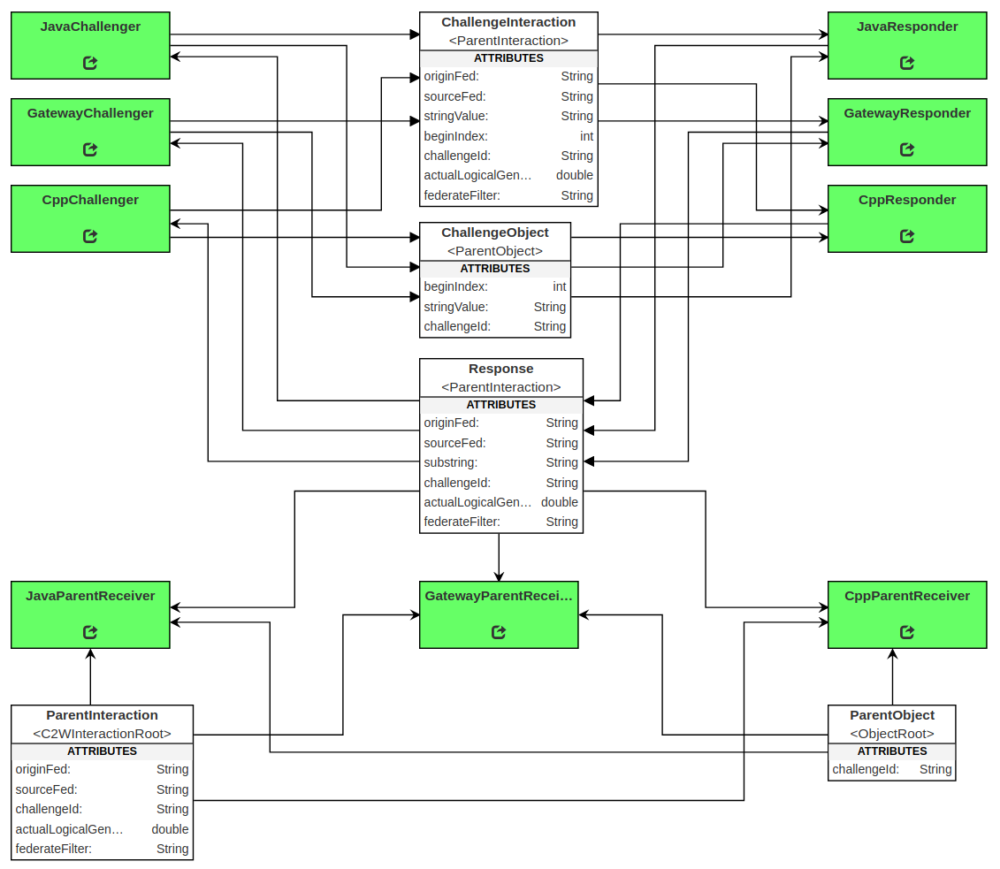

# Challenge-Response Test Federation

This federation was designed to test whether Java, C++, and Gateway federates could exchange string and numeric data without error. The challenger federates generate a random string and an index into that string which is sent to the HLA federation. The responder federates must respond with the substring that starts from the generated index. If an unexpected value is seen by any federate at any point during the execution, it will be logged as an error. When the federation ends, the run script will output all errors to the terminal.

## Installation and Use

### Dependencies

All the required dependencies for this federation are included in the UCEF v1.0.0 BETA virtual machine. The code has dependencies on:

- Java 8
- Maven 3
- [ucef-core](https://github.com/usnistgov/ucef-core)
- [ucef-cpp](https://github.com/usnistgov/ucef-cpp)
- [ucef-gateway](https://github.com/usnistgov/ucef-gateway)
- Internet access to download maven dependencies

### How to Install

Install the federation using the `build.sh` script co-located with this README file.

### How to Run

Run the federation using the `run.sh` script co-located with this README file. The run process is fully automated.

The run script will create an additional terminal for each federate in the federation. These windows are scripted to appear at specific screen coordinates. You may experience errors when running at lower than 1024x768 resolution.

To exit the federation, go to the terminal that executed run.sh and follow the prompt. Any terminals that remain open after the run script exits must be closed by hand. Once the terminals are closed, the command `pkill ChallengeResponse` must be executed to kill the background C++ processes.

### Expected Output

The run script will create 10 terminal windows in sequence, with a several second delay between each new terminal. After the last terminal opens, the federation will start logical time progression and continue to execute until the federation is terminated. The federation should be run for at least several hundred logical time steps, although multiple hours or overnight execution is recommended for meaningful results.

The federation will create a directory named `logs` that contains a set of text files that record the content of each terminal. These files are timestamped and will not be overriden by multiple runs. Due to the potential size of these files, this directory should be purged often.

At the end of the run script, the output statements from the log files that contain the word **ERROR** will be output to the terminal executing the run script. If an **ERROR** is output, unless noted in the Known Issues below, there is a problem that needs to be fixed in the code. 

## Federation



The federation contains 3 types of federates that each have 3 different implementations using Java, Gateway, and C++.

### Challenger

The challenger federates generate challenges that are sent the federation, and test if the responses to those challenges are correct. A challenge is a randomly generated string paired with an integer index of one of the elements. A correct response for a given challenge is the substring that starts from the challenge index. To generate the correct response, a federate must understand both the string and numeric data in the challenge.

A challenge can fail for the following reasons:
1. The response references a challenge that was never issued,
1. The response originated from a federate that has already responded to the associated challenge,
1. The associated challenge has already received the expected number of responses,
1. The associated challenge has already passed its expiration time, and
1. The response is not the correct response for the associated challenge.

### Responder

The responder federates generate and send a response in reaction to each challenge received. 

### Parent Receiver

The parent receiver federates monitor the federation traffic to test HLA's automatic upcasting of interaction classes and object classes. If the HLA automatic upcasting feature works, these federates should receive one instance of the parent class for each challenge issued during the federation execution. To verify that each challenge sent is upcasted and received, this class subscribes to the response interaction. Each time a parent class is received, the challenge id is stored. Each time a response is received, its associated challenge is checked against the stored challenge ids. If this federate receives a response for a challenge that has never been stored, then either the response is corrupt or the challenge was never upcasted to its parent class.

## Known Issues

The current version of the federation will not terminate due to a bug that prevents C++ federates from exiting. This will result in a significant number of the following error messages from the C++ federates:

```
ERROR [main] portico.lrc: Currently ticking
ERROR:  FederateResignInteraction:  could not send interaction:  Exception caught ... retry
```

Because these messages are a known issue, they should be considered expected behavior and ignored.

