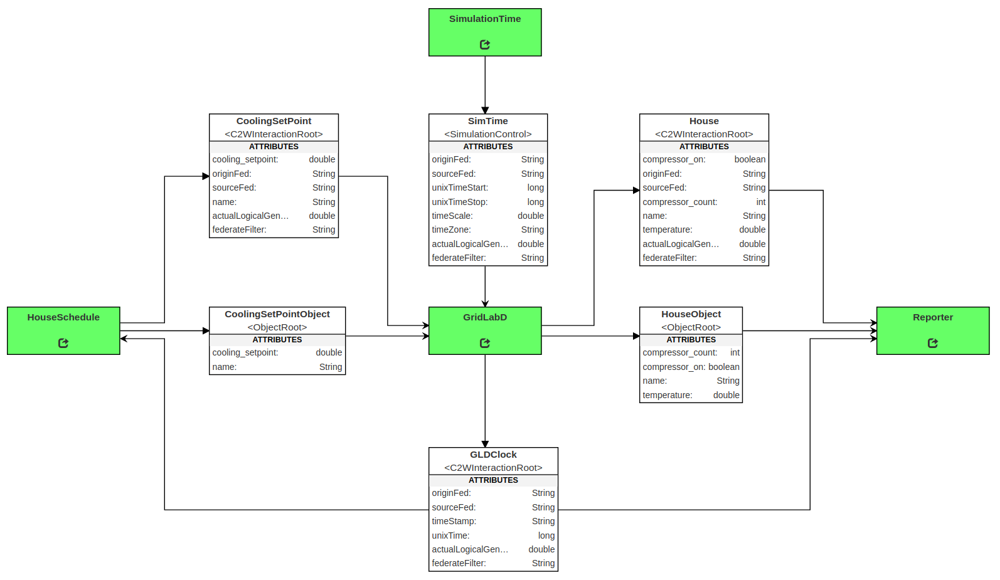

# GridLAB-D Example

The GridLAB-D example federation was designed to test the GridLAB-D federate implementation. However, it also shows how to use the different features of the GridLAB-D federate. This sample federation demonstrates the following capabilities:

1. how to represent GridLAB-D objects as both interaction classes and object classes;
2. how to subscribe to the GridLAB-D global clock variable; and,
3. how to annotate the XML configuration file to configure the GridLAB'D federate.

## Installation and Use

### Dependencies

All the required dependencies for this federation are included in the UCEF v1.0.0 BETA virtual machine. The code has dependencies on:

- Java 8
- Maven 3
- [GridLAB-D](https://github.com/gridlab-d/gridlab-d)
- [ucef-core](https://github.com/usnistgov/ucef-core)
- [ucef-gateway](https://github.com/usnistgov/ucef-gateway)
- [ucef-gridlabd](https://github.com/usnistgov/ucef-gridlabd)
- Internet access to download maven dependencies

### How to Install

Execute the `build.sh` script in this directory to start the maven installation procedure on federation source code.

### How to Run

Execute the `run.sh` script in this directory to start an automated process that runs the entire federation on the local machine.

The run script will create an additional terminal for each federate in the federation. These windows are scripted to appear at specific screen coordinates. You may experience errors when running at lower than 1024x768 resolution.

To exit the federation, go to the terminal that executed `run.sh` and follow the prompt. This will close the individual federate terminal windows.

### Expected Output

The run script will create 5 terminal windows in sequence. There will be a several second delay between each new terminal, and the entire process can take minutes. After the last terminal, the federation will start to progress logical time as indicated by the `t=1.0` output statements. At `t=96.0`, the terminal named GridLAB-D will exit and logical time will progress at a much faster rate. At this point, the `run.sh` script should be stopped to terminate the federation. The federation will execute forever unless the `run.sh` script is manually stopped.

The federation will create several files. A directory named `logs` will be created in this directory with a set of text files that store the content of each terminal window. These files are timestamped and will not be overridden by multiple runs. GridLAB-D will create a data record at `src/GLDExample_generated/GridLabD/model/house_data.csv` with time series data for the houses in the GridLAB-D model. The house data will be overridden by each new run, and the `# date` comment at the top of the file should be examined to make sure the house data corresponds to the expected run.

The house data should contain values for 3 houses over 24 hours for the day 2009-06-02. At 08:45:00 and 17:45:00 the set points for both House 1 and House 2 should change, while House 3 remains constant. The final compressor count will differ from run to run, but approximate values for each house are House 1: 120, House 2: 80, and House 3: 100. In all runs, House 2 should have the lowest value for compressor count.

## Federation

The GridLAB-D example federation (DESCRIPTION)

The federation has 4 federates, excluding the federation manager, that are described in detail below.

### Simulation Time
### House Schedule
### GridLAB-D
### Reporter

## Important Notes

### Logical Time Delay

### XML Configuration File

The file `src/GLDExample_generated/GridLabD/conf/GridLAB-D.xml` demonstrates some of the configuration options specific to GridLAB-D that can be embedded into the XML configuration file. These options will all be in the namespace `ucef`.
