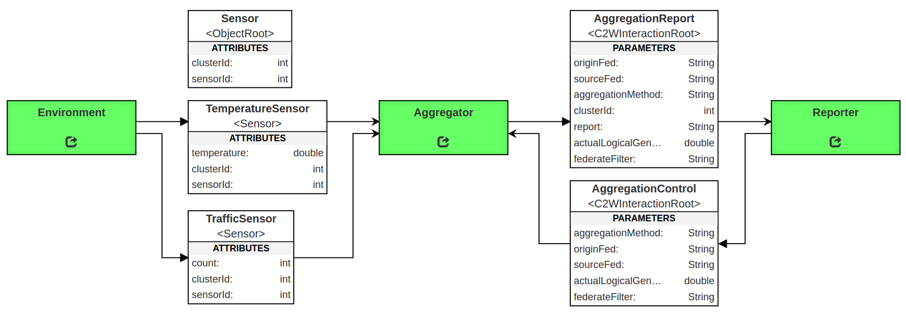

# UCEF Gateway Example: Sensor Aggregator

Assume we have a sensor network with different types of sensors that measure different values using different data types. These sensors are grouped into clusters, and each cluster reports one aggregate value from its membership to reduce network traffic. The clusters have homogeneous membership, and no cluster will contain two sensors that produce different measurements.

Let each sensor be represented by an HLA object. There is a base Sensor object that contains the attributes shared by all sensor types: the unique sensor ID and the name of its cluster. Each sensor type will extend this base sensor with one or more additional attributes that represent its measurements. In the example shown below, a temperature sensor defines a floating point temperature attribute, and a traffic sensor defines an integer vehicle counter attribute. 
 

The goal of the Sensor Aggregation federation is to create an Aggregator federate that subscribes to these sensor objects and produces one aggregation report for each sensor cluster. This sample project implements the Aggregator federate, as well as the federation shown in the diagram above as an example federation.

## Installation and Use

1. Clone and install v1.0.0 of the UCEF-Gateway federate (https://github.com/usnistgov/ucef-gateway)
2. Run `mvn install` in the Aggregator, Environment, and Reporter directories of this project
3. Run `./run.sh` in the FederationManager directory of this project, and wait for the server to come online
4. Run `./run.sh` in the Aggregator, Environment, and Reporter directories of this project in any order

## Environment Federate

The environment federate has a configuration file with four properties:

1.	minimumClusterSize – the minimum number of sensors in a cluster
2.	maximumCluserSize – the maximum number of sensors in a cluster
3.	numberOfTrafficClusters – the number of clusters of TrafficSensor objects
4.	numberOfTemperatureClusters – the number of clusters of TemperatureSensor objects

It uses these settings to register and populate the sensor objects during initialization before the federation achieves the synchronization point readyToRun. During each logical time step, each traffic sensor reports a random value 0 – 10 and each temperature sensor reports a random value 20.0 – 26.0.

## Reporter Federate

The reporter federate has a configuration file with one property:

1. aggregationMethod - either `maximum` or `sum` to indicate how aggregation reports should be generated

The reporter will send an AggregationControl interaction to the aggregator during initialization to indicate the aggregation method that should be used to produce reports. It will then act as a passive participant in the federation which outputs any received aggregation reports each time step.

## Aggregator Federate

The aggregator federate receives the AggregationControl interaction and discovers all ObjectRoot.Sensor object instances during initialization, and then produces aggregation reports each logical time step for the object reflections it receives. It was not designed to discover new objects during logical time progression, and will throw an exception if a new sensor object is registered after the readyToRun synchronization point.

The aggregator federate has no knowledge of the structure of the TemperatureSensor and TrafficSensor objects. It was designed to receive any arbitrary object class derived from ObjectRoot.Sensor, and aggregate all the parameters it receives at runtime. To accomplish this, it looks up the data type of all received sensor attributes in the object model as it receives object updates. 

## Features Tested

This federation was designed to cover the following features of UCEF Gateway:

1.	Sending and receiving interactions
2.	Sending and receiving object reflections
3.	Registering and reusing persistent object instances
4. Performing initialization between federates using receive order messages
5.	Converting received values into the correct data types (integer and double)
6.	Working with full interaction/object class paths
7.	Using a custom JSON configuration file
