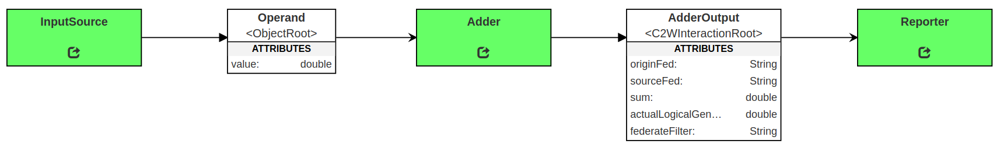

# Simple Adder Example

A simple test federation that demonstrates the basic capabilities (configuration, send/receive interaction, send/receive object) of WebGME generated federates. The source code is heavily commented and intended to be a reference implementation for how to implement a Java federate. Refer to the individual federate implementations located in `SimpleAdder_generated/SimpleAdder-java-federates/SimpleAdder-impl-java/`.

## Installation and Use

### Dependencies

All the required dependencies for this federation are included in the UCEF v1.0.0 BETA virtual machine. The code has dependencies on:

- Java 8
- Maven 3
- [ucef-core](https://github.com/usnistgov/ucef-core)
- Internet access to download maven dependencies

### How to Install

Execute the `build.sh` script at the top level directory.

### How to Run

Execute the `run.sh` script at the top level directory. This script will create a separate terminal window for each federate in the federation. These windows are scripted to appear at specific screen coordinates. You may experience errors when running at lower than 1024x768 resolution.

To exit the federation, go to the terminal that executed `run.sh` and follow the prompt.

### Expected Output

The run script will create 4 terminal windows in sequence. After the last terminal opens, the federation will start to progress logical time. The federation will continue to run until the `run.sh` script is stopped.

The output of each terminal will be stored in files located in the `logs` directory. These files are timestamped and will not be overriden by multiple runs.

The input source terminal will output the values of 2 operands each logical time step starting from `t=0`. The reporter terminal will output the sum of the 2 operands starting from `t=2`. The value output by the reporter at `t=i` for any value **i** should be equal to the sum of the operands that were output at `t=i-2`.

## Federation

The simple adder federation contains 3 federates that are described below.

### Input Source

The input source federate registers multiple Operand object instances, and generates a new random value for each operand at each logical time step. Both the number of operands and the maximum value for operands are specified in the JSON configuration file. The default values are 2 operands with a maximum value of 10. 

### Adder

The adder federate sums the values received from updated Operand instances each logical time step, and reports the value through a published interaction.

### Reporter

The reporter federate outputs the result from the adder to its terminal.

## Logical Time Delay

One important concept that the simple adder federation demonstrates is logical time delays between when a message is sent and received. It takes one logical time step for a message to propogate between a pair of federates. In the simple adder example, it takes 1 time step for the updated operand values to reach the adder, and 1 logical time step for the adder sum to reach the reporter. Because of these delays, an operand updated at `t=i` will be summed at `t=i+1` and output by the reporter at `t=i+2`.

It is possible to avoid these time delays for highly interactive federates through use of receive order messages, a flag that can be set for interactions and object classes in WebGME. However, these federates would have a much different implementation than the ones demonstrated in this simple example.

